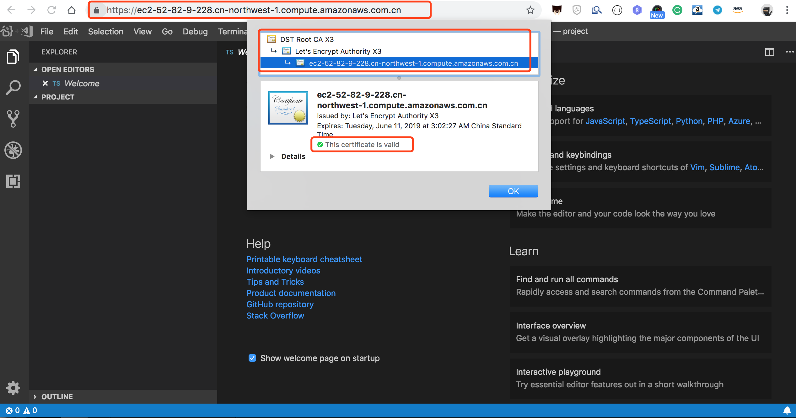
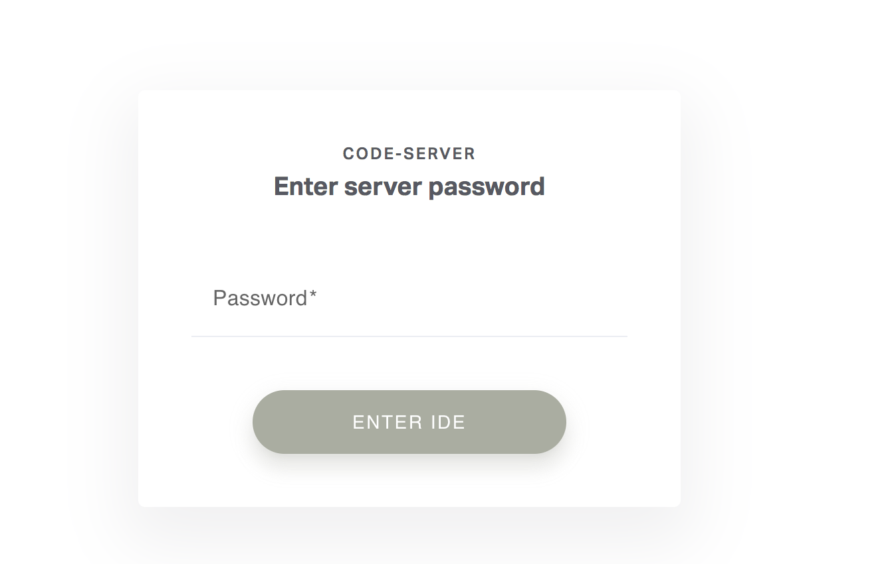
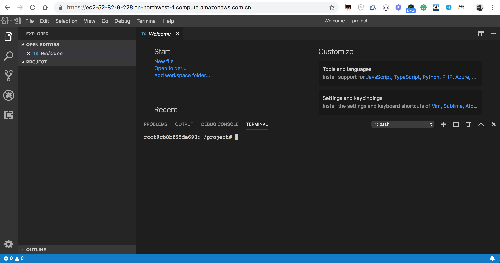

# coder-server-aws

[Coder](https://coder.com/) is an open source remote development environment serving **Visual Studio Code** and this project helps you host your own `Coder server` on AWS with **fully automatic HTTPS support**.



# Features

- [x] Automatic HTTPS support with Caddy web server and `Let's Encrypt` certificate on-the-fly generation
- [x] Support almost all AWS Regions including **China regions**
- [x] Simply `make run` to spin everything up. No configuration required.


# Howto

Git clone this project

```
git clone https://github.com/pahud/coder-server-aws.git
cd coder-server-aws
```

Docker build the image

```
sudo make build
```

This will build `coder-docker:latest` in the local.

Spin up the service

```
$ sudo make run
b6ff786376be796f02a4315231403383fab01891cffdb45bcf137ac35e34c80a
open https://ec2-52-82-9-228.cn-northwest-1.compute.amazonaws.com.cn
```

Copy the https URL. We will open it later.


check the Caddy log

```
sudo make logtail-caddy
```

You should be able to see the Caddy log, indicating the TLS certificate generation from `let's encrypt` is complted and start serving on HTTPS port 443.

```
Activating privacy features... 2019/03/12 20:02:16 [INFO][FileStorage:/root/.caddy] Started certificate maintenance routine
2019/03/12 20:02:18 [INFO] acme: Registering account for admin@domain.com
2019/03/12 20:02:18 [INFO] [ec2-52-82-9-228.cn-northwest-1.compute.amazonaws.com.cn] acme: Obtaining bundled SAN certificate
2019/03/12 20:02:19 [INFO] [ec2-52-82-9-228.cn-northwest-1.compute.amazonaws.com.cn] AuthURL: https://acme-v02.api.letsencrypt.org/acme/authz/_VSGl8Fdxs51A9ZAZ69V6P5JWwrsTP3hEPFahzAOM30
2019/03/12 20:02:19 [INFO] [ec2-52-82-9-228.cn-northwest-1.compute.amazonaws.com.cn] acme: use tls-alpn-01 solver
2019/03/12 20:02:19 [INFO] [ec2-52-82-9-228.cn-northwest-1.compute.amazonaws.com.cn] acme: Trying to solve TLS-ALPN-01
2019/03/12 20:02:27 [INFO] [ec2-52-82-9-228.cn-northwest-1.compute.amazonaws.com.cn] The server validated our request
2019/03/12 20:02:27 [INFO] [ec2-52-82-9-228.cn-northwest-1.compute.amazonaws.com.cn] acme: Validations succeeded; requesting certificates
2019/03/12 20:02:29 [INFO] [ec2-52-82-9-228.cn-northwest-1.compute.amazonaws.com.cn] Server responded with a certificate.
2019/03/12 20:02:30 [WARNING] Stapling OCSP: no OCSP stapling for [ec2-52-82-9-228.cn-northwest-1.compute.amazonaws.com.cn]: parsing OCSP response: ocsp: error from server: unauthorized
done.

Serving HTTPS on port 443 
https://ec2-52-82-9-228.cn-northwest-1.compute.amazonaws.com.cn

2019/03/12 20:02:30 [INFO] Serving https://ec2-52-82-9-228.cn-northwest-1.compute.amazonaws.com.cn 

Serving HTTP on port 80 
http://ec2-52-82-9-228.cn-northwest-1.compute.amazonaws.com.cn

2019/03/12 20:02:30 [INFO] Serving http://ec2-52-82-9-228.cn-northwest-1.compute.amazonaws.com.cn 
WARNING: File descriptor limit 1024 is too low for production servers. At least 8192 is recommended. Fix with `ulimit -n 8192`.
```

check the `coder-server` log

```
sudo make logtail-coder
```

Response

```
$ sudo make logtail-coder
WARN  No certificate specified. This could be insecure.
WARN  Documentation on securing your setup: https://coder.com/docs
INFO   
INFO  Password: f048d39044431a7634b21ecd
INFO   
INFO  Started (click the link below to open):
INFO  http://localhost:8443/
INFO   
INFO  Connected to shared process
ERROR SHARED stderr {"data":"Uncaught Exception:  Error: ENOENT: no such file or directory, open '/root/.local/share/code-server/Backups/workspaces.json'\n\nError: ENOENT: no such file or directory, open '/root/.local/share/code-server/Backups/workspaces.json'\n    at Timeout.setTimeout [as _onTimeout] (eval at exports.requireModule (/usr/local/bin/code-server:468:27625), <anonymous>:67388:31)\n    at ontimeout (timers.js:498:11)\n    at tryOnTimeout (timers.js:323:5)\n    at Timer.listOnTimeout (timers.js:290:5)\n"}
```

You'll see the `Password` for Coder from it. You can Ignore the `Timeout` error. 


Let's open the browser. Enter the `Password` in the prompt and enter the IDE.




Have fun!!

